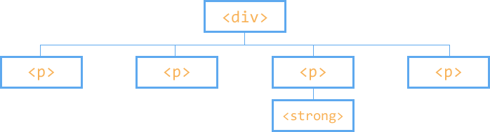

## DOM bejárás

<p style="text-align:justify">A DOM bejárás ( angolul traversing ) egy fontos része a JavaScript/jQuery-nek. A jQuery DOM bejárás segítségével bejárhatjuk a dokumentumunk szerkezetét és megkereshetjük azt az elemet/elemeket, amire éppen szükségünk van. Mindezt úgy tehetjük meg, hogy figyelembe vesszük az elhelyezkedését a többi eleméhez képest. Addig ugrálunk a különböző szinteken, amíg el nem érünk ahhoz, ami nekünk kell.</p>

<p style="text-align:justify">Lényegében 5 fajta relációt különböztetünk meg a kapcsolódó elemek között. A gyerek – szülőt, leszármazott – ős/felmenőt és a testvért. Ezek tulajdonképpen mind a való életből vett kapcsolatok. A gyerek – szülő egyértelmű, azonban ebben az esetben egy gyereknek, csak egy szülő elme lehet, viszont egy szülőelemnek számtalan gyerek eleme. A leszármazott – felmenő, hasonlítható a nagyszülőkre, dédszülőkre. Ha egy elemnek kijelöljük a felmenőit, akkor visszakapjuk az összes létező felmenőjét, ugyan ez igaz, ha kijelöljük a leszármazottait, mindet visszakapjuk. A testvér elem kijelölővel a dokumentumban az egy szinten lévő elemeket jelölhetjük ki.</p>

<p style="text-align:justify">Mint tudjuk a DOM egy olyan strukturált szerkezet, ahol az elemek alá és fölé rendeltségi viszonnyal kapcsolódnak egymáshoz. A DOM bejárása tulajdonképpen a kijelölési módszerek finomítása. Nézzük példával illusztrálva.</p>

Adott az alábbi DOM szerkezet:

```html
    <div>
        <p>Bekezdés 1</p>
        <p class=""text>Bekezdés 2<strong>Leszármazott </strong></p>
        <p>Bekezdés 3</p>
        <p>Bekezdés 3</p>
    </div>
```

<div style="text-align:center"></div>

<p style="text-align:justify">Jól látható, hogy szerkezetileg a p elemek a div elem gyerekei, vagyis a div elem a p elemek szülő eleme. Tudjuk azt is, hogy a p elemek egymás testvérei, mivel egy szinten helyezkednek el. Tovább megfigyelhetjük azt is, hogy a strong elem a div elem leszármazottja, valamint a div elem a strong elem ős eleme. Ez a tudás valószínű ismerős a HTML/CSS ismereteink megszerzése során. Nézzünk pár kijelölést!</p>

Elsőként jelöljük ki a második p elemet:

```js
      $(function() {
            var seconf = $("p").eq(1).text();
            alert(second);
      });
 ```

<p style="text-align:justify">Kijelöljük az összes p elemet, majd az eq() eljárással kijelöljük szám szerint az elsőt, valamint a text() eljárás segítségével érjük el, hogy a second változóban a második p elem szövege kerüljön. Ezek után mindezt egy figyelmeztető ablakban jelenítjük meg. Az eq() eljárásban, azért az egyes szám szerepel, mert mint a legtöbb programozási nyelvben, úgy itt is, a tömb, vagy tömbszerű adattárolás során nullától kezdjük számozni az értékeket.</p>  

### Leszármazott kijelölők – children(), find()


<p style="text-align:justify">Leszármazott kijelölőknek nevezzük azokat a kijelölőket, amik egy elem leszármazottait jelölik ki. Két fajtája a children() és a find(). A lényeges eltérés az, hogy a children(), csak a közvetlen leszármazottakat adja vissza, vagyis a gyerekeket, míg a find() az összes leszármazottat visszaadhatja.</p>

```js
      $(function() {
            var p = $("div").children();
            console.log(p);
      }); 
 ```

<p style="text-align:justify">Ez a megoldás a console panelre kiírja a p objektum tartalmát, amiben láthatjuk a négy darab p elemünket.</p>

<p style="text-align:justify">A find eljárás ettől egy kicsit eltérő. Itt az eljáráson belül kell megadnunk, hogy melyik leszármazott elemet keressük. Jelen esetben ez a strong elem, ami a p elem leszármazottja. Ha az összes leszármazottat szeretnénk visszakapni, akkor a find(“*”) eljárást kell alkalmaznunk.</p>  

```js
      $(function() {
            var p = $("div").find("strong");
            console.log(p);
      }); 
 ```

### Ős kijelölők – parent(), parents()

<p style="text-align:justify">Az ős kijelölőkkel kijelölhetjük a közvetlen szülőket és a felmenőket. A parent() eljárás jelöli ki csak a szülőket, míg a parents() az összes felmenőt.</p>  

A parent() eljárást alkalmazva a p elemekre vissza kapjuk a div elemet:

```js
      $(function() {
            var p = $("p").parent();
            console.log(p);
      }); 
 ```

<p style="text-align:justify">Ugyan ebben a kontextusban a parents() eljárást alkalmazva visszakapjuk a p elem összes ősét, vagyis a div, body és html elemet.</p>


```js
      $(function() {
            var p = $("p").parents();
            console.log(p);
      }); 
 ```

<p style="text-align:justify">A parents() eljárást a find() eljáráshoz hasonlóan hásználhatjuk konkrét elemre is, mint például a find(“ul”), ami csak az ul felmenőket adja vissza.</p>

### Testvér kijelölés – siblings()  

<p style="text-align:justify">A siblings() eljárással visszakapjuk a megadott elem testvéreit, vagyis a DOM-ban az azonos szinten elhelyezkedő elemeket. A lépegetésre az eredmények között számos egyéb eljárás létezik.</p>

```js
      $(function() {
            var p = $("p").siblings();
            console.log(p);
      }); 
 ```

<p style="text-align:justify">Az eljárás ebben az esetben visszaadja a p elemet és annak testvéreit, azonban ha ugyan ezen lenne egy h2-es elem és annak szeretnénk kijelölni a testvér elemeit, akkor csak a 4 p elemet kapnánk vissza, vagyis saját magát nem. Elvileg, a siblings() eljárás a saját magát nem adja hozzá a kijelöléshez, azonban ebben az általános esetben még is.</p>

### Kijelölések további szűrése – not(), add(), filter(), first(), last(), eq()  

#### not(), add()  

<p style="text-align:justify">A kijelöléseinket bővíthetjük, vagy szükíthetjük a nekünk tetsző elemekkel. Értelem szerűen az add() eljárással hozzáadhatunk, míg a not()-al kivonhatunk elemeket a kijelölésből.</p>

```js
      $(function() {
            var p = $("p").siblings().add("div");
            console.log(p);

            var p = $("p").parents().not("html");
            console.log(p);
        }); 
 ```

#### filter()

<p style="text-align:justify">A filter eljárás segítségével egy adott kijelölt halmazból kiválaszthatjuk azokat, amik megfelelnek egy kritériumnak. Így csak azt a p elemet kapjuk vissza, ami text értékű osztály kijelölővel rendelkezik.</p>  

```js
      $(function() {
            var p = $("p").filter(".text");
            p.css("background", "aqua");
      }); 
 ```

#### first(), last()

<p style="text-align:justify">A fist(), last() eljárás értelemszerűen a kijelölt elemekből az elsőt és az utolsót adja vissza.</p>  

```js
      $(function() {
            var p = $("p").first();
            p.css("background", "olive");

            var p = $("p").last();
            p.css("background", "olive");
      }); 
 ```

#### eq()

<p style="text-align:justify">Az eq() eljárás az :eq() pseudo kódnak megfelelő eljárás, segítségével visszakapjuk az x-edik elemet. Természetesen a számolást itt is nullától kell kezdenünk!</p>  

```js
      $(function() {
            var p = $("p").eq(2);
            p.css("background", "pink");
      }); 
 ```

#### Eljárások összefűzése – chaining

<p style="text-align:justify">A jQuery rugalmasságának egy másik példája az összefűzési megoldás. Ha egy eljárásnak a visszatérési értéke jQuery objektum, akkor az eljárás után azonnal alkalmazhatunk egy másikat, így hozzáfűzve azt.</p>  

```js
      $(function() {
            var p = $(".text").siblings().andSelf();
            console.log(p);
      }); 
 ```
<p style="text-align:justify">Ebben a példában visszakapjuk a három p elemet, ahol a class tulajdonság nem text és az andSelf() eljárással hozzáadjuk a .text tulajdonságú elemet is.</p>  

<p style="text-align:justify">Ha megfelelően tudunk a DOM-ban lépkedni, olyan magas szintű kijelőléseket hozhatunk létre, amikkel bármit kijelölhetünk a dokumentumunkon belül.</p>  
