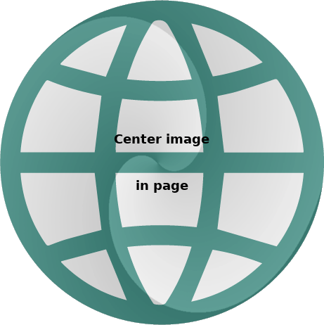

## Események


<p style="text-align:justify"></p>


```html


```

<p style="text-align:justify"></p>


```js
 
 
 ```

<p style="text-align:justify"></p>


```html
   <html> code 
 ```

<p style="text-align:justify">Sorkizárt szöveg sorkizárt szöveg sorkizárt szöveg sorkizárt szöveg sorkizárt szöveg sorkizárt szöveg sorkizárt szöveg sorkizárt szöveg sorkizárt szöveg sorkizárt szöveg sorkizárt szöveg sorkizárt szöveg sorkizárt szöveg sorkizárt szöveg sorkizárt szöveg sorkizárt szöveg sorkizárt szöveg sorkizárt szöveg sorkizárt szöveg sorkizárt szöveg sorkizárt szöveg sorkizárt szöveg sorkizárt szöveg sorkizárt szöveg.</p>

<p style="text-align:left">Balra igazított szöveg</p>  
<p style="text-align:center">Középre igazított szöveg</p>  
<p style="text-align:right">Jobbra igazított szöveg</p>  

```js
   javascript code 
 ```

<div style="text-align:center"></div>

```
   <pre>
        <code>
               P R E F O R M T T E D   S Z Ö V E G
        </code>
   </pre>
 ```

<div style="width: 100%; text-align: center;">
<button onclick="window.location.href = 'bevezetes01demo.html';">
 Button.css("text-align", "center")
</button>
</div>  


