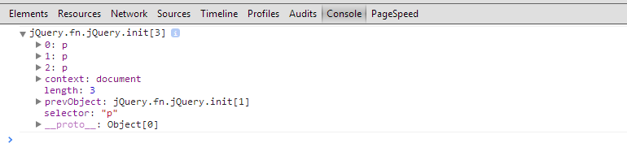
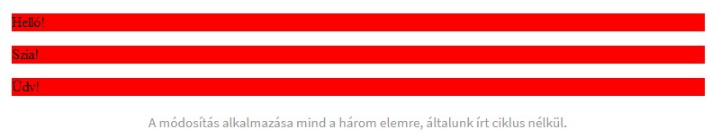

## Kijelölők  

<p style="text-align:justify;">A jQuery népszerűsége az egyszerűségében és a használhatóságában rejlik. Ahhoz, hogy kijelöljünk az oldalunkon egy elemet nincs más dolgunk, mint használni a CSS-ben megszerzett, kijelölőkkel kapcsolatos tudásunkat. A CSS-ben használatos kijelölők mindegyikét alkalmazhatjuk egy-egy jQuery kijelölésben. JavaScript-ben a getElementById() eljáráson kívül – ami az ideális esetben csak egy eredményt ad vissza – ciklust kellett alkalmaznunk, hogy megtaláljuk a tömbünkben a megfelelő elemet. A jQuery-ben véget vetettek a nehézkes kijelölésnek és igyekeztek a lehető legintuitívabb megoldásokat alkalmazni, sikerrel!</p>
    
<p style="text-align:justify">Ne felejtsük el, hogy a jQuery is javascript, ezért úgy hozzuk létre oldalunkat, hogy ha a javascript ki van kapcsolva a böngészőben, akkor is élvezhető legyen az oldal használata.</p>

### Általános kijelölők

<p style="text-align:justify">Ahogy korábban említettem, kijelölés során nincs más dolgunk, mint használni a CSS kijelölőket a megfelelő módon, nézzünk példákat!</p>

$(“p”) – Bekezdés elemek kijelölése.  

$(“#box”) – A box id-vel rendelkező elem kijelölése.  

$(“div#box”) – A box id-vel rendelkező div elem kijelölése.  

$(“.box”) – A box class tulajdonsággal rendelkező elem kijelölése.  


<p style="text-align:justify">A keretrendszer kihasználja a CSS 1-3 nyújtotta kijelölési lehetőségeket, így a CSS ismeretében gyorsabban tudunk átállni a használatára. Gyorsabban tudunk létrehozni számunkra ésszerű kijelöléseket.</p>  

Példával illusztrálva egy kijelölés a következőképpen néz ki, a css() eljárás alkalmazásával:

```js
    $(function() {
        $("body").css("background", "#ccc");
    });
```

<p style="text-align:justify">A fenti kóddal a body háttérszínét világos szürkére állítjuk. A kódot a ready() eljárás rövidített változatán belül helyezzük el, mivel a kód a dokumentumunk head részében helyezkedik el, így meg kell várnunk, amíg az letölt.</p>

<p style="text-align:justify">A kijelölés során egy jQuery objektumot kapunk vissza, amiben megtalálható a kijelölt elem/elemek. A hangsúly az elemeken van, hiszen, ha egy oldalon kijelöljük csak a p tag-eket – amikből általában több van – akkor mindegyik p tag és tartalma bekerül az objektumunkba. Tehát, ha lefuttatjuk a következő kódrészletet és megnézzük a fejlesztő eszközünk console panelját, akkor a visszakapott objektumban megtaláljuk az előzőleg elhelyezett összes p taget, azok tartalmát és adatait.</p>

```html
        <p>Helló!</p>
        <p>Szia!</p>
        <p>Üdv!</p>
```

```js
    $(function() {
        var p = $("p");
        console.log(p);
    );
```

<div style="text-align:center"></div>

<p style="text-align:justify">Ha módosításokat akarok végrehajtani egy ilyen objektumon, felmerül a kérdés, hogy hogyan is járjuk be. Szerencsénkre a jQuery erre is egy egyszerű megoldást biztosít, ha egy olyan kijelölőre alkalmazunk egy utasítást, amiből több van egy oldalon, akkor a program ciklusszerűen bejárja azokat és alkalmazza a változtatásokat.</p>

```js
    $(function(){
        var p = $("p");
        p.css("background", "red");
    );
```

<div style="text-align:center"></div>

<p style="text-align:center; font-style:italic;">A módosítás alkalmazása mind a három elemre általunk írt ciklus nélkül</p>

### jQuery pseudo kijelölők

<p style="text-align:justify">Már tudjuk, hogy kijelölőként alkalmazhatjuk az összes CSS kijelölőt, beleértve a pseudo kijelölőket is, azonban a jQuery plusz megoldásokat is nyújt a kijelölések során a saját pseudo kódjainak a segítségével. A kijelölések során a jQuery egyik legnagyobb előnye, hogy az általunk beírt kijelölőt nem csak egyszerűen át veszi a CSS-ből, hanem a keretrendszer figyel arra is, hogy a korábbi böngészőkben is működjön. A saját pseudo kijelölőivel olyan dolgokat is megvalósíthatunk, amiket a CSS-el nem, vagy csak nehezen. A teljes listát megtekinthetjük a hivatalos dokumentációban!</p>

Példaként nézzük meg az :even és az :odd, vagyis a páros és páratlan kijelölőket.  

```html
  <table>
        <tr>
              <td>Sor1</td>
        </tr>
        
        <tr>
              <td>Sor2</td>
        </tr>
        
        <tr>
              <td>Sor3</td>
        </tr>
        
        <tr>
              <td>Sor4</td>
        </tr>
  </table>
```

```js
  $("table tr:even").css("background", "#444");
  $("table tr:odd").css("background", "#aaa"); 
```

<p style="text-align:justify">Adott egy négy soros táblázat. Az :even és :odd jQuery pseudo kijelölők segítségével egyszerűen elkülönítjük a páratlan és páros sorokat az egyedi háttérszín segítségével.</p>  

### This kijelölő

<p style="text-align:justify">A this kulcsszóval, valamilyen kontextusban a legtöbb programozási nyelvben találkozhatunk. A használatuk általában teljesen egyezik is. JavaSciprt ben a this kulcsszó egy olyan speciális változó, amivel hivatkozhatsz az aktuális elemre, amivel dolgozol.</p>  

Egy egyszerű példával illusztrálva a dolog, a következőképpen néz ki:

```js
    $(function(){
        var p = $("p");

            p.click(function() {
                $(this).css("background", "red");
            );
    );
```
  
<p style="text-align:justify">A fenti kódnál a HTML rész a korábban megadott három db bekezdés. A bekezdés elemekhez hozzáadtunk egy kattintás eljárást, ezen belül pedig ugyan ehhez az elemhez – a this kulcsszó segítségével – egy css() eljárást.</p>  

### Cache – avagy a jQuery gyorsítótárazás  

<p style="text-align:justify">JavaScript-ben az egyik legnagyobb erőforrás problémát a DOM bejárása okozza. Minél többször lépünk be, keresni a DOM-on belül, annál jobban lelassítjuk a kódot. Erre kínál megoldást a cachelés/gyorsítótárazás néven ismert megoldás, melynek a lényege, hogy a többször felhasznált kijelölők eredményét eltároljuk egy változóban, így elkerülve, hogy a következő használatnál a program újra bejárja a szerkezetünket.</p>  

Tehát, lassú megoldásnak tekinthető az alábbi:

```js
    $(function(){
        $("p").css("background", "red");
        $("p").css("color", "white");
    );

```  

Míg a következő verzió sokkal gyorsabb működést biztosít:

```js
    $(function(){
        var p = $("p");
        
        p.css("background", "red");
        p.css("color", "white");
    );

```  
  
<p style="text-align:justify">Természetesen minél többször jelöljük ki az adott szakaszt, annál jobban lassítjuk a kód lefutását. Ilyen kis mértékben még talán elnézhető, de nagyobb kódrészleteknél már látható eredményt produkálhat.</p>

<p style="text-align:justify">A jQuery talán legkényelmesebb szolgáltatása/újítása a kijelölők használata, nagyon egyszerűen beletanulhatunk. Az összes CSS kijelölő és a jQuery saját pseudo kódjainak köszönhetően bármit kitudunk jelölni. Kiemelendő, hogy a jQuery-ben használt CSS kijelölők a régebbi, olyan böngészőkben is működnek, amik alap esetben nem támogatják CSS-ben azt, mivel a keretrendszer készítői figyeltek a kompatibilitásra, így biztosak lehetünk benne, hogy egy újabb CSS3-as kijelölő működni fog akár még a régi Internet Explorer-ek alatt is, amennyiben jQuery kódsorunkban azzal hivatkozunk egy adott elemre.</p>

